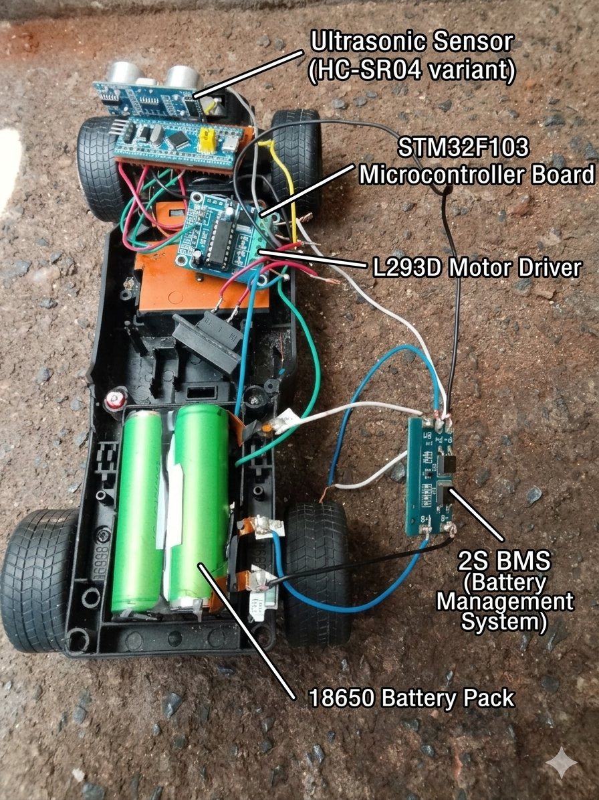
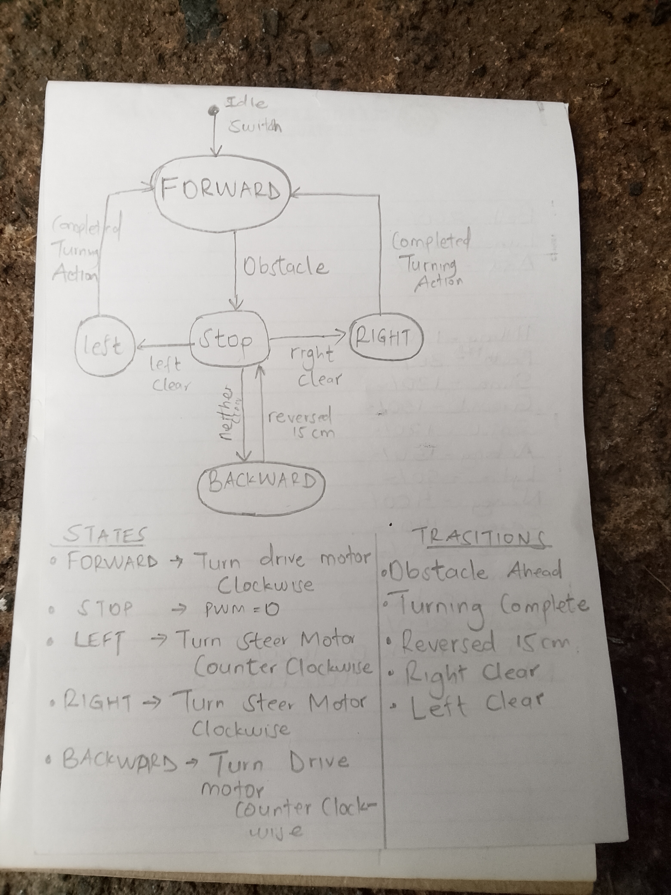

# STM32 Baremetal Autonomous Car

This is a baremetal C state machine project controlling DC motors and ultrasonic sensors on an STM32F103C8T6.

### Hardware Setup
Here is a picture of the autonomous car chassis:

### FINITE STAE MACHINE DIAGRAM

